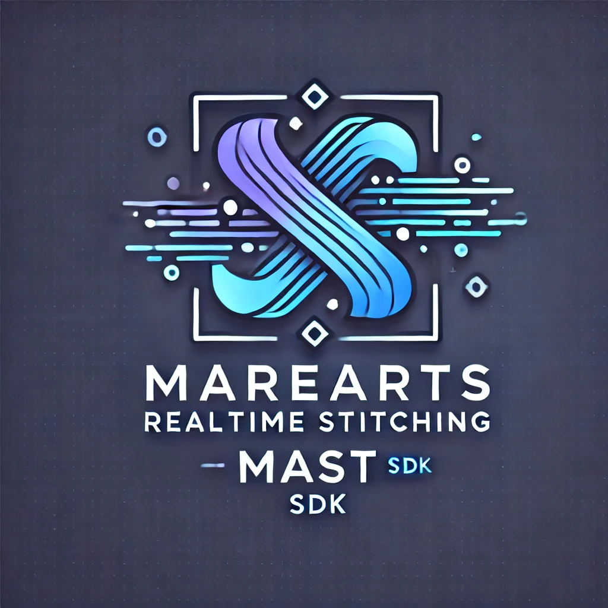
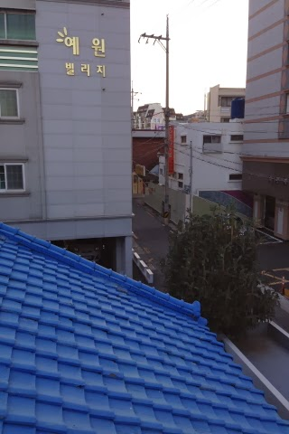
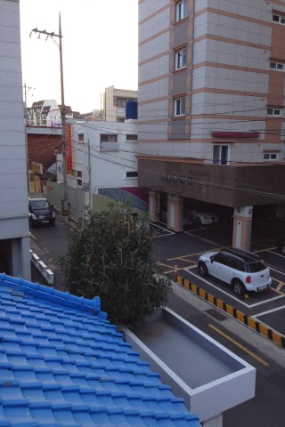
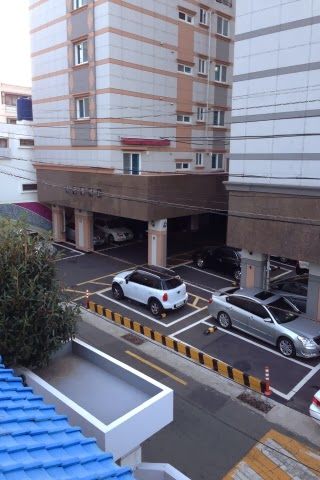
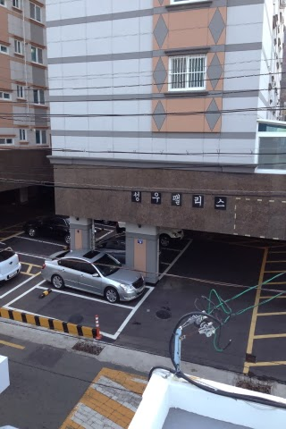
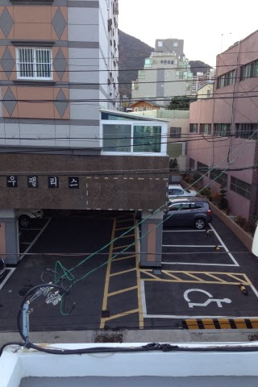
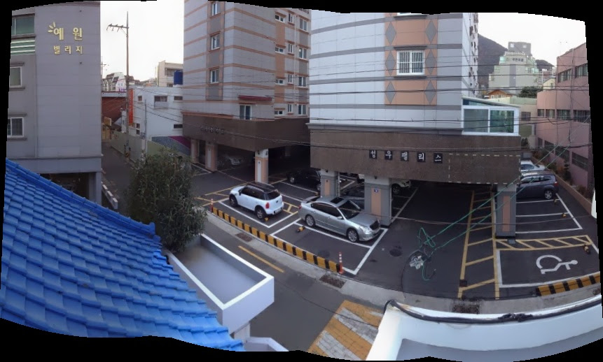
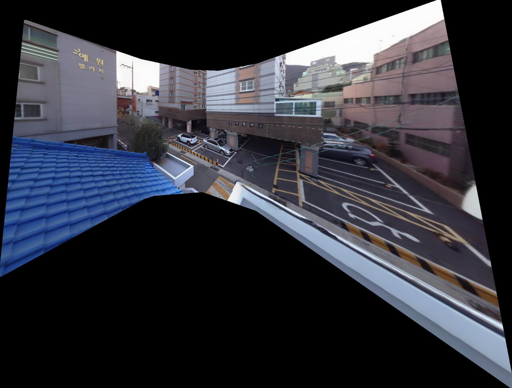

# MareArts Realtime Stitching SDK (MAST) 🔄🖼️

<div align="center">
  
  <p><i>High-performance real-time video stitching solution</i></p>
</div>

## Overview

MAST (MareArts Realtime Stitching) is a high-performance SDK for real-time image and video stitching. MAST leverages the power of both CPU and GPU acceleration to provide fast, high-quality panoramic stitching suitable for a variety of applications including:

- 📹 Multi-camera panoramic video systems
- 🔍 Security and surveillance
- 📺 Live event broadcasting
- 🥽 Virtual reality content creation
- ✨ And more!

[](https://youtube.com/playlist?list=PLvX6vpRszMkwNYWyr89I_Pe9FhdxsUeD8&si=4W9Upou4mmJuk5aj)
[](https://study.marearts.com/p/marearts-realtime-stitching-sdk.html)

## Demo Results

<div align="center">
  <h3>Example Input Images</h3>
  <table>
    <tr>
      <td></td>
      <td></td>
      <td></td>
      <td></td>
      <td></td>
    </tr>
    <tr>
      <td align="center"><b>S1.jpg</b></td>
      <td align="center"><b>S2.jpg</b></td>
      <td align="center"><b>S3.jpg</b></td>
      <td align="center"><b>S4.jpg</b></td>
      <td align="center"><b>S5.jpg</b></td>
    </tr>
  </table>
  
  <h3>Stitching Results</h3>
  <table>
    <tr>
      <td></td>
      <td></td>
    </tr>
    <tr>
      <td align="center"><b>Cylindrical Projection</b></td>
      <td align="center"><b>Planar Projection</b></td>
    </tr>
  </table>
</div>

## System Requirements 💻

### Windows
- Windows 10 or later (64-bit)
- NVIDIA GPU with CUDA support
- CUDA Toolkit 12.8
- OpenCV 4.8.1 with CUDA support
- Visual Studio 2022
- Intel TBB (Thread Building Blocks)

### Linux (Ubuntu)
- Ubuntu 20.04 LTS or later
- NVIDIA GPU with CUDA support
- CUDA Toolkit 12.8
- OpenCV 4.1.0/4.1.1 with CUDA support
- GCC/G++ 9.0 or later

## Installation 🔧

### Windows
1. Install OpenCV 4.8.1 with CUDA modules
2. Install CUDA Toolkit 12.8
3. Install Intel TBB
4. Update the paths in the .bat files to match your installation directories
5. Create a 'params' directory in your working folder to store calibration parameters

### Linux
1. Install OpenCV with CUDA modules
2. Install CUDA Toolkit 12.8
3. Update the paths in the .sh files to match your installation directories
4. Create a 'params' directory in your working folder to store calibration parameters

## SDK Structure 📦

The SDK includes:
- Header files (`MareArtsStitcher.h`)
- Library files (`MareArtsStitcher.lib`, `MareArtsStitcher.so`, `MareArtsStitcher.dll`)
- Example code demonstrating various use cases
- Test utilities to verify your environment setup
- Build scripts for Windows (.bat) and Linux (.sh)

## Getting Started

### 1. Serial Number Configuration 🔑

Before using the SDK, you need to set up your serial number and email in the `SN.h` file:

```cpp
std::string MY_SN = "your_serial_code";
std::string MY_EMAIL = "your_email";
```

Replace "your_serial_code" and "your_email" with the credentials provided to you.

### 2. Verify Your Environment ✅

Before using the SDK, it's recommended to verify your environment using the provided test utilities:

**Windows (.bat)** / **Linux (.sh)**:
```
b1_test_cuda             # 🧪 Tests CUDA functionality
b2_test_opencv           # 🧪 Tests basic OpenCV functionality
b3_test_opencv_cuda      # 🧪 Tests OpenCV with CUDA integration
T1_MAST_dll_load_test    # 🧪 Tests MAST library loading and license verification
T2_bestpractice_test     # 🧪 Tests CUDA memory management used in MAST
```

If all tests run successfully, your environment is properly configured for MAST.

### 3. Build and Run Examples 🚀

For Windows, use the provided .bat files to build and run the examples:

```
1_MAST_calibration_N_stitching.bat
```

For Linux, use the provided .sh files to build and run the examples:

```
./1_MAST_calibration_N_stitching.sh
```

### 4. Asset Preparation 🎬

Place your input videos or camera inputs in the appropriate location. The examples are configured to use videos from an `../ASSETS/` directory, with files named:
- `soccer_L1.mp4`
- `soccer_C1.mp4`
- `soccer_R1.mp4`

Adjust the file paths in the code to match your input sources.

## Test Utilities 🧪

The SDK includes several test utilities to verify your environment is properly set up:

### 🔍 CUDA Verification
**`b1_test_cuda`** (.bat/.sh)
- ✓ Verifies that CUDA is properly installed and functioning
- ✓ Performs a simple GPU calculation to test CUDA functionality
- ✓ Reports the CUDA runtime version

### 🔍 OpenCV Basic Test
**`b2_test_opencv`** (.bat/.sh)
- ✓ Tests basic OpenCV functionality
- ✓ Loads, processes, and saves an image
- ✓ Verifies OpenCV is properly installed and linked

### 🔍 OpenCV CUDA Integration Test
**`b3_test_opencv_cuda`** (.bat/.sh)
- ✓ Tests the integration between OpenCV and CUDA
- ✓ Verifies that GPU-accelerated OpenCV operations work correctly
- ✓ Processes an image using the GPU

### 🔍 MAST License Test
**`T1_MAST_dll_load_test`** (.bat/.sh)
- ✓ Verifies that the MAST library loads correctly
- ✓ Tests license verification
- ✓ Ensures your environment can run MAST applications

### 🔍 MAST Best Practices Test
**`T2_bestpractice_test`** (.bat/.sh)
- ✓ Tests CUDA memory management techniques used in MAST
- ✓ Verifies pinned memory allocation works correctly
- ✓ Essential for high-performance GPU-based stitching

## Example Descriptions 📋

The SDK includes several examples to demonstrate different use cases:

### Example 1️⃣ - Basic Calibration and Stitching
**`1_MAST_calibration_N_stitching.cpp`**
- 🔹 Performs one-time calibration of input frames
- 🔹 Demonstrates real-time stitching after calibration
- 🔹 Shows basic SDK configuration

### Example 2️⃣ - Calibration and Parameter Saving
**`2_MAST_calibration_N_saveParam.cpp`**
- 🔹 Performs calibration of input frames
- 🔹 Saves the calibration parameters to a file for later use
- 🔹 Useful for pre-calibrating camera setups

### Example 3️⃣ - Loading Parameters and Stitching
**`3_MAST_loadParam_N_stitching.cpp`**
- 🔹 Loads previously saved calibration parameters
- 🔹 Performs real-time stitching using these parameters
- 🔹 Bypasses the need for recalibration

### Example 4️⃣ - Separate Class Instances
**`4_MAST_Aclass_calibration_saveParam_N_loadParam_Bclass_stitching.cpp`**
- 🔹 Uses one MAST instance for calibration and another for stitching
- 🔹 Demonstrates parameter transfer between instances
- 🔹 Useful for systems with separate calibration and production workflows

### Example 5️⃣ - Combined Workflow
**`5_MAST_calibration_saveParam_N_loadParam_stitching.cpp`**
- 🔹 Shows a complete workflow in one example
- 🔹 Calibrates, saves parameters, loads parameters, and stitches

### Example 6️⃣ - Advanced Thread-based GPU Stitching
**`6_best_practice_video_thread_gpuOnly_MAST_calibration_N_stitching.cpp`**
- 🔹 Demonstrates multi-threaded video processing
- 🔹 Uses GPU for maximum performance
- 🔹 Implements best practices for real-time applications
- 🔹 Includes interactive calibration approval

### Example 7️⃣ - Production-Ready Implementation
**`7_best_practice_thread_gpuOnly_MAST_loadParam_N_stitching.cpp`**
- 🔹 Implements a production-ready stitching pipeline
- 🔹 Uses multi-threading for video capture and display
- 🔹 Loads pre-calibrated parameters for immediate stitching
- 🔹 Optimizes GPU memory transfer using pinned memory

## API Overview 💻

### Initialization

```cpp
MareArtsStitcher MAST;
if (MAST.check_SNcertification(MY_EMAIL, MY_SN) == false) {
    std::cout << "certification fail" << std::endl;
    return false;
}
MAST.DisplayCertificationInfo();
```

### Configuration

```cpp
// Basic configuration
MAST.m_use_GPU = true;                        // Enable/disable GPU acceleration
MAST.m_FeatureMatchConfidence = 0.5;          // Feature matching confidence threshold
MAST.m_FeatureFindAlgorithm = "akaze";        // Feature detection algorithm ("akaze", "orb", "sift")
MAST.m_PairingConfidence = 0.5;               // Pairing confidence threshold
MAST.m_ExposureCompensatorType = "gain";      // Exposure compensation method
MAST.m_ImageBlendingAlgorithm = "multiband";  // Blending algorithm ("no", "multiband", "feather")
MAST.m_ImageWarppingWay = "plane";            // Projection type ("plane", "cylindrical", "spherical")
MAST.m_MatchingEstType = "homography";        // Matching estimation type
MAST.m_BA_EstCOSTFuncType = "reproj";         // Bundle adjustment cost function type
MAST.m_blend_strength = 5;                    // Blending strength (0-100)
```

### Calibration

```cpp
cv::Mat result;
if (MAST.calibrateFrame(frames, result) == false) {
    std::cout << "calibration error" << std::endl;
    return false;
}
```

### Parameter Management

```cpp
// Save calibration parameters
MAST.saveCameraParams("./params/save_param");

// Load calibration parameters
MAST.loadCameraParams("./params/save_param");
```

### Stitching

```cpp
// CPU Stitching
cv::Mat result_st;
MAST.stitcher(frames, result_st);

// GPU Stitching
cv::cuda::GpuMat result_st_gpu;
MAST.stitcher(frames_gpu, result_st_gpu);
result_st_gpu.download(result_st);  // If CPU result is needed
```

## Best Practices ⭐

1. **Environment Setup**: Run the test utilities (b1, b2, b3, T1, T2) first to ensure your environment is properly configured.

2. **Calibrate Once, Stitch Many**: For fixed camera setups, calibrate once and save the parameters for repeated use.

3. **Use GPU Acceleration**: For real-time applications, use GPU acceleration by setting `MAST.m_use_GPU = true;`

4. **Multi-threading**: Use separate threads for video capture, stitching, and display for optimal performance as shown in examples 6 and 7.

5. **Pinned Memory**: For best GPU performance, use pinned memory for efficient CPU-GPU data transfer as demonstrated in the thread-based examples.

6. **Algorithm Selection**: 
   - For speed: use "orb" feature detection and "feather" blending
   - For quality: use "akaze"/"sift" and "multiband" blending
   
7. **Progressive Implementation**: Start with the basic examples (1-3) to understand the workflow, then move to the more advanced examples (4-7).

## Troubleshooting ⚠️

- **Certification Error**: Verify your serial number and email in the SN.h file.
- **Calibration Failure**: Try different frames or adjust the feature detection parameters.
- **DLL Loading Error**: Ensure the PATH environment variable includes all necessary DLL directories.
- **Performance Issues**: Check GPU usage and consider using the multi-threaded examples.
- **Library Linking Errors**: Verify that the paths in the .bat/.sh files match your installation directories.

## Resources 📚

### 💲 SDK Subscription
**[Get your MAST SDK subscription here!](https://study.marearts.com/p/marearts-realtime-stitching-sdk.html)**

Access the full power of MAST SDK through our flexible subscription plans:
- **Monthly License**: Ideal for short-term projects
- **Annual License**: Perfect for ongoing development
- **Lifetime License**: Best value for long-term use

All subscriptions include:
- Complete SDK with all features
- Regular updates and improvements
- Technical support
- Documentation and examples

### 🎬 Video Tutorials
Visit our [YouTube Channel](https://youtube.com/playlist?list=PLvX6vpRszMkwNYWyr89I_Pe9FhdxsUeD8&si=4W9Upou4mmJuk5aj) for video tutorials and demonstrations of MAST in action.

<!-- Insert a direct video thumbnail here - replace VIDEO_ID with an actual YouTube video ID from your channel -->
[](https://youtube.com/playlist?list=PLvX6vpRszMkwNYWyr89I_Pe9FhdxsUeD8&si=4W9Upou4mmJuk5aj)

### 📝 Blog
Check out our [blog](https://study.marearts.com) for the latest news, tutorials, and updates on MAST.

### 📞 Support
For additional support, please contact:
- Email: hello@marearts.com
- Website: https://marearts.com

---

© MareArts. All rights reserved.
